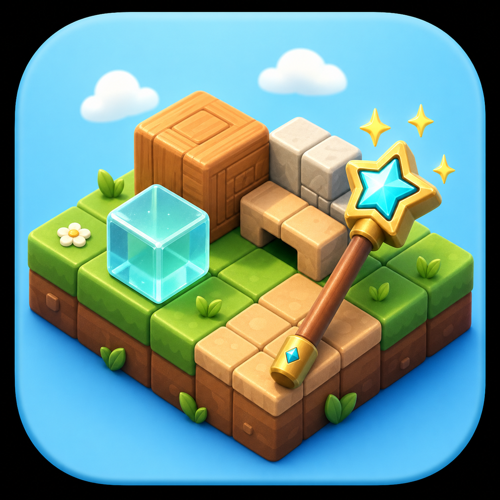
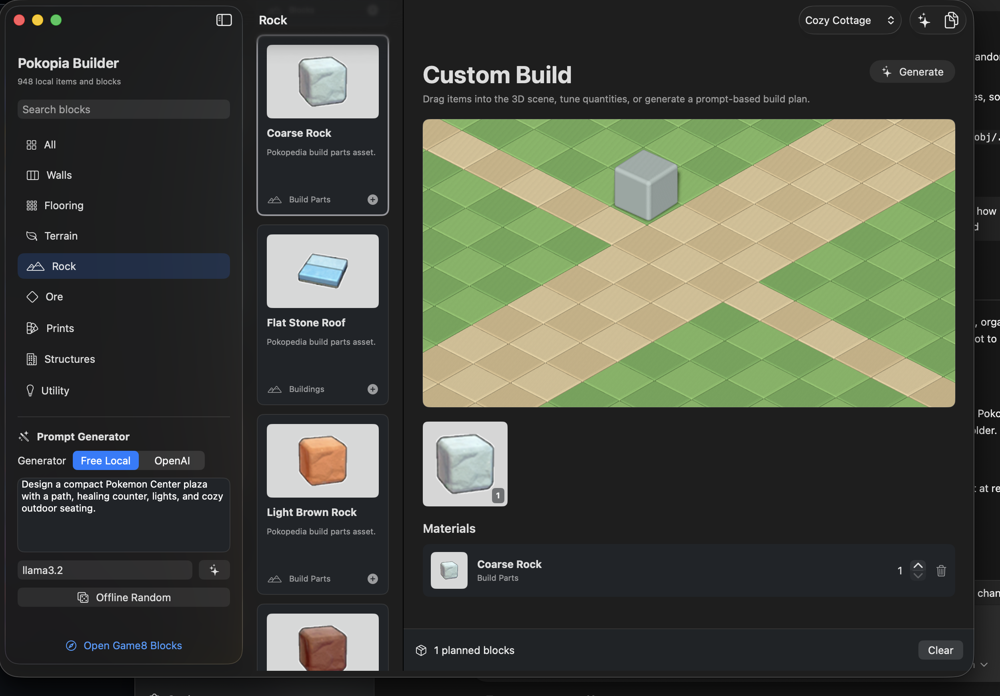

# Pokopia Builder

<p align="center">
  
</p>

Pokopia Builder is a native macOS arm64 SwiftUI app for planning **Pokemon Pokopia** builds. It combines a local item/block catalog, build material lists, prompt-based build generation, and a SceneKit 3D planning view.



## Current Features

- Native macOS SwiftUI app, built with Swift Package Manager.
- Local catalog with `948` items/blocks/material records.
- Pokopedia asset integration for item thumbnails.
- Generated catalog with `714` craftable recipe records and `213` habitats.
- Searchable item/block library.
- Category filters for walls, flooring, terrain, rock, ore, prints, structures, and utility items.
- Drag-and-drop placement into a SceneKit 3D build view.
- Materials list with quantities.
- Free local prompt generation mode.
- Optional OpenAI prompt generation mode.
- Procedural 3D fallbacks for blocks, floors, walls, crystals, lights, roads, carpets, ores, rocks, and construction pieces.
- Real 3D model override pipeline for `.usdz`, `.scn`, `.dae`, and `.obj` files.
- macOS app icon and DMG packaging script.

## Download

The distributable DMG is published in GitHub Releases.

If building locally, run:

```bash
scripts/build-pokopia-builder-app.sh
```

Output:

```text
dist/Pokopia Builder.app
dist/Pokopia-Builder-0.1.0-arm64.dmg
```

## Requirements

- macOS 14 or newer
- Apple Silicon Mac for the packaged arm64 build
- Xcode command line tools
- Optional: Pokopedia installed at `/Applications/Pokopedia.app`
- Optional: Ollama running at `http://localhost:11434`
- Optional: OpenAI API key for OpenAI mode

## How It Was Created

This started as a native macOS SwiftUI app target named `PokopiaBuilder`.

The app was built in layers:

1. **SwiftUI shell**
   - `PokopiaBuilderApp.swift`
   - `ContentView.swift`
   - split-view app layout with sidebar, catalog, and build workspace

2. **Local catalog**
   - initial block data was seeded from public Pokopia block/material references
   - local Pokopedia app assets were discovered under:
     `/Applications/Pokopedia.app/Wrapper/Pokopedia.app/assets/assets`

3. **Generated catalog**
   - `scripts/pokopia/build-pokopia-catalog.js`
   - merges local Pokopedia assets with public recipe/material/habitat metadata
   - writes `Sources/PokopiaBuilder/Resources/pokopia-catalog.json`

4. **3D scene**
   - `BuildSceneView.swift`
   - uses SceneKit inside SwiftUI
   - first pass used PNG cutouts and generic blocks
   - current pass uses procedural shape profiles and supports real model overrides

5. **Prompt generation**
   - `LocalBuildIdeaClient.swift`
   - free local mode uses Ollama when available
   - if Ollama is not running, a built-in heuristic prompt parser still generates themed builds
   - `OpenAIBuildIdeaClient.swift` supports optional OpenAI Responses API generation

6. **Packaging**
   - original app icon was generated as a Pokopia-inspired voxel/build-grid mark
   - converted to `.icns`
   - `scripts/build-pokopia-builder-app.sh` builds the app and DMG

## 3D Model Limitations

The app does **not** currently have official in-game mesh files.

The Pokopedia app and public crafting pages provide excellent metadata and PNG icons, but they do not include:

- real mesh geometry
- UV maps
- material channels
- model dimensions
- collision bounds
- pivots/origins
- animation data
- official `.glb`, `.fbx`, `.obj`, `.usdz`, or `.scn` assets

Because of that, the current 3D view uses:

- procedural construction blocks for floors/walls/rocks/tiles/lights
- cutout fallbacks for some furniture/items
- real model overrides when supplied by the user

## What We Need

The most important next step is building or sourcing a real 3D model library.

Needed assets:

- `.usdz`, `.scn`, `.dae`, or `.obj` models
- one file per item/block when possible
- screenshots from multiple angles for manual/procedural modeling
- shape profile notes for items without models

Highest-priority model categories:

- floor tiles
- wall blocks
- rocks/stones/ores
- roads and paths
- stairs/steps
- cube lights and lamps
- tables/chairs/counters
- Pokemon Center wall pieces
- windows/doors
- trees, flowers, and habitat props

Drop local models into:

```text
~/Documents/Pokopia Models
```

Supported extensions:

```text
.usdz
.scn
.dae
.obj
```

Example names:

```text
coarse-rock.scn
red-rock.scn
crystal-wall.usdz
cube-light.obj
pokemon-center-wall-lower.scn
```

The app automatically matches models by item slug.

## Generating Placeholder Models

There is a small procedural model generator:

```bash
scripts/pokopia/make-procedural-model.swift coarse-rock cube B8CBC5
scripts/pokopia/make-procedural-model.swift red-rock cube 9B503B
scripts/pokopia/make-procedural-model.swift crystal-wall crystal 74D8FF
```

Supported shapes:

- `cube`
- `floor`
- `wall`
- `crystal`
- `cylinder`
- `lamp`

## Build From Source

```bash
swift build -c release --product PokopiaBuilder
```

Package as app + DMG:

```bash
scripts/build-pokopia-builder-app.sh
```

## Data Sources

See:

- [Pokopia data sources](DataSources/POKOPIA-SOURCES.md)
- [3D model pipeline](DataSources/POKOPIA-3D-MODELS.md)

## Legal / Attribution Note

This is an unofficial fan/development tool. It is not affiliated with Nintendo, The Pokemon Company, Game Freak, or Creatures Inc.

The app icon is original Pokopia-inspired artwork and intentionally avoids official Pokemon/Nintendo characters, logos, and symbols.

Pokopia item names and references are used for planning/catalog purposes. Users should ensure they have rights to any imported 3D models before distributing them.
